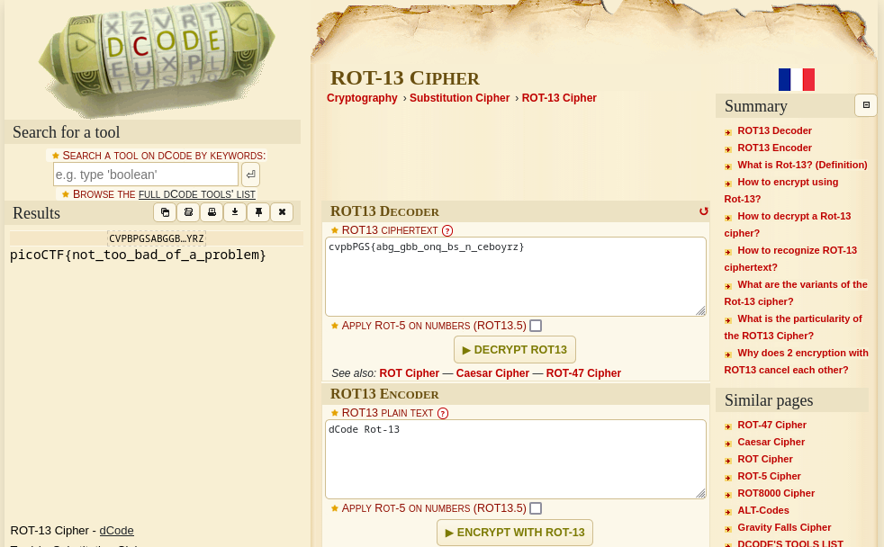

### 13
Tags:  

------------
Author: Alex Fulton/Daniel Tunitis 
**Description** 
Cryptography can be easy, do you know what ROT13 is? `cvpbPGS{abg_gbb_onq_bs_n_ceboyrz}`

------------

**Hints** 
1-This can be solved online if you don't want to do it by hand!

------------
# Solution
1-Using a [ROT13](https://www.dcode.fr/rot-13-cipher) Decoder  
2-the Result is: picoCTF{not_too_bad_of_a_problem} 
3- the flag is:`picoCTF{not_too_bad_of_a_problem}` 
# Screenshots

