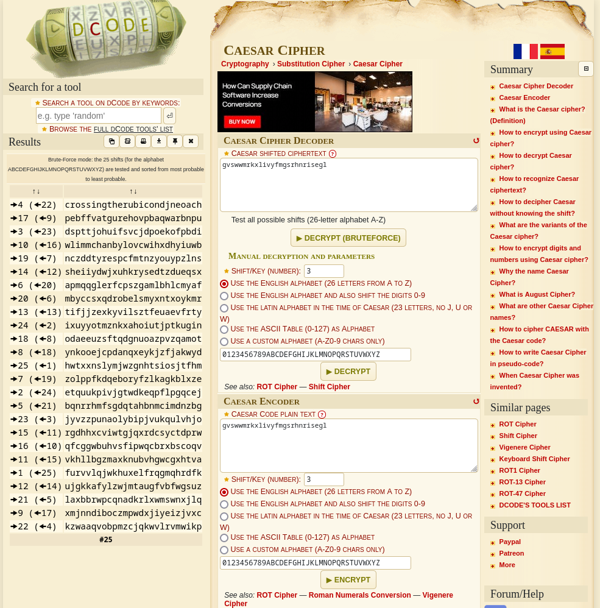

### Caesar
Tags:  

------------
Author: Sanjay C/Daniel Tunitis 
**Description** 
Decrypt this [message](https://jupiter.challenges.picoctf.org/static/7d707a443e95054dc4cf30b1d9522ef0/ciphertext).

------------

**Hints** 
1-caesar cipher [tutorial](https://learncryptography.com/classical-encryption/caesar-cipher)

------------
# Solution
1-Using a [Caesar Cipher](https://www.dcode.fr/caesar-cipher) Decoder  
2-the most readable Result is: crossingtherubicondjneoach 
3- the flag is:`picoCTF{crossingtherubicondjneoach}` 
# Screenshots

