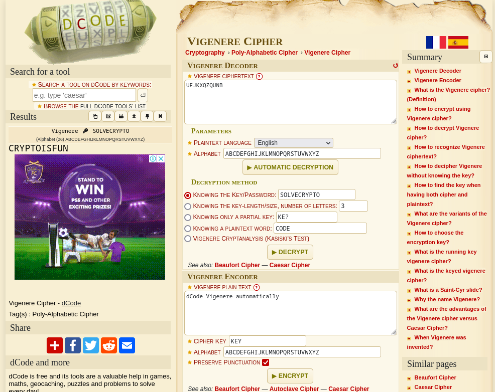

### Easy1
Tags:  

------------
Author: Alex Fulton/Danny 
**Description** 
The one time pad can be cryptographically secure, but not when you know the key. Can you solve this? We've given you the encrypted flag, key, and a [table](https://jupiter.challenges.picoctf.org/static/1fd21547c154c678d2dab145c29f1d79/table.txt) to help `UFJKXQZQUNB` with the key of `SOLVECRYPTO`. Can you use this table to solve it?. 
------------

**Hints** 
1-Submit your answer in our flag format. For example, if your answer was 'hello', you would submit 'picoCTF{HELLO}' as the flag. 
2-Please use all caps for the message.

------------
# Solution
1-Looking at the Table i thought i was a [Caesar Cipher](https://www.dcode.fr/caesar-cipher) but what is the key for that's when i quickly figueresd out it was a [Vigenere Cipher](https://www.dcode.fr/vigenere-cipher)  
2-Using the [Vigenere Cipher](https://www.dcode.fr/vigenere-cipher) Decoder  
3-the Result is: CRYPTOISFUN  
5- the flag is:`picoCTF{CRYPTOISFUN}` 
# Screenshots

