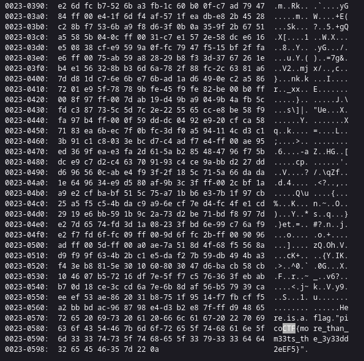

### Glory of the Garden
Tags:  

------------
Author: jedavis/Danny 
**Description** 
This [garden](https://jupiter.challenges.picoctf.org/static/4153422e18d40363e7ffc7e15a108683/garden.jpg) contains more than it seems.
------------

**Hints** 
1-What is a hex editor? 

------------
# Solution
1-  upload the picture into a hex editor [Link](https://www.fileformat.info/tool/hexdump.htm) 
2- find "ctf" 
3- the flag is:
`picoCTF{more_than_m33ts_the_3y33dd2eEF5}` 
# Screenshots

