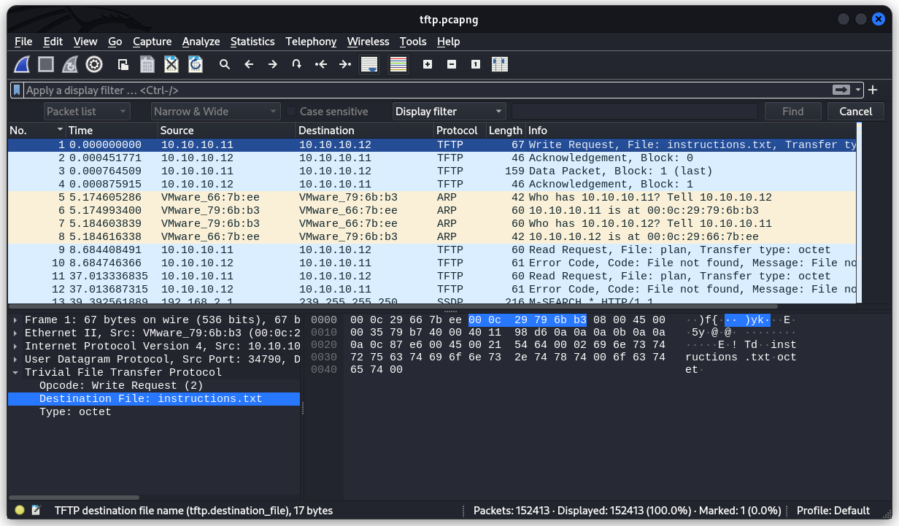
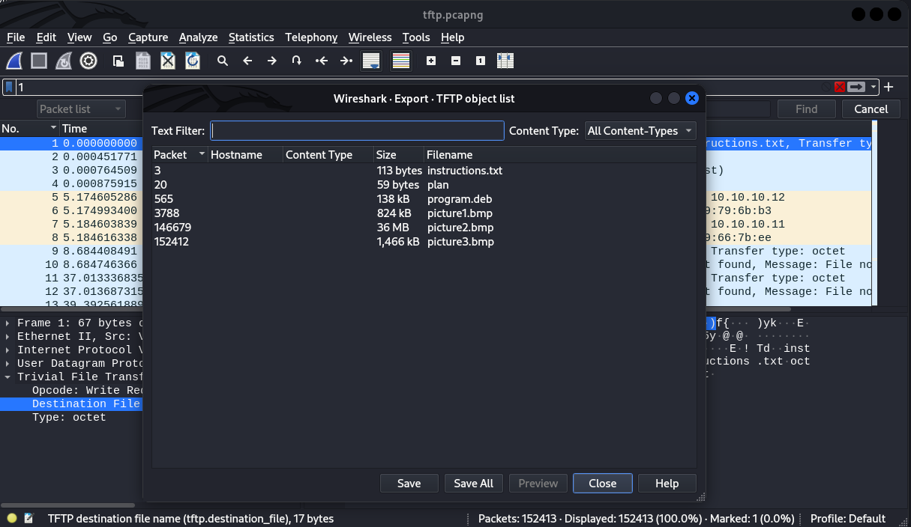
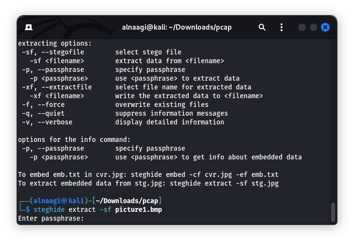
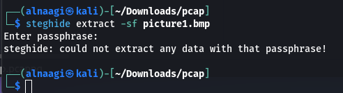
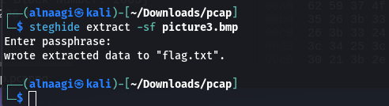
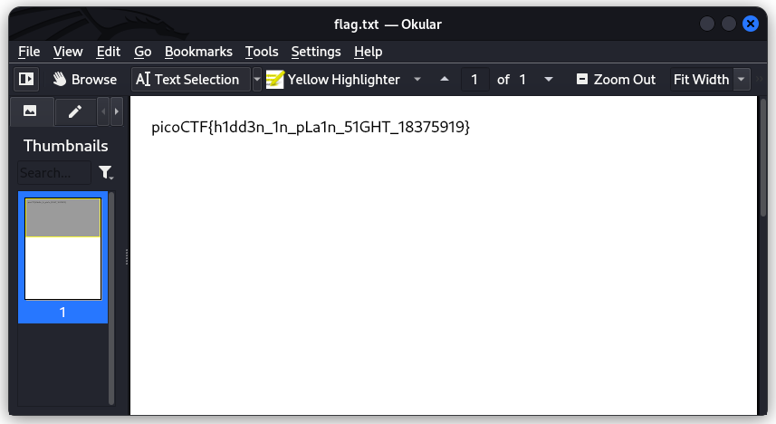

### Trivial Flag Transfer Protocol
Tags:  

------------
Author: Danny 

**Description** 
Figure out how they moved the [flag](https://mercury.picoctf.net/static/ed308d382ae6bcc37a5ebc701a1cc4f4/tftp.pcapng).
------------

**Hints** 
1-What are some other ways to hide data? 

------------
# Solution
1- the ctf is named Trivial Flag Transfer Protocol so it has something to do with tftp.  
2-Upon opening the pcapng file in Wireshark, frame 1 immediately caught my eye within Wireshark, I observed a TFTP transfer for "instructions.txt". Leveraging Wireshark's export capability `File->Export Objects->TFTP` , I retrieved the file and subsequently identified additional hidden objects. All files were then downloaded and archived, initiating the flag extraction process. 

3-First thing I did was open instructions.txt, which contained an encrypted text. I didn't know what kind of encryption it was, so I entered it into a cipher identifier ([https://www.dcode.fr/cipher-identifier](https://www.dcode.fr/cipher-identifier)). The result identified it as a ROT-13 cipher ([https://www.dcode.fr/rot-13-cipher](https://www.dcode.fr/rot-13-cipher)), so I decrypted the text, and the result was:
`TFTPDOESNTENCRYPTOURTRAFFICSOWEMUSTDISGUISEOURFLAGTRANSFER FIGUREOUTAWAYTOHIDETHEFLAGANDIWILLCHECKBACKFORTHEPLAN`.
>TFTP DOESNT ENCRYPT OUR TRAFFIC SO WE MUST DISGUISE OUR FLAG TRANSFER FIGURE OUT AWAY TO HIDE THE FLAG AND IWILL CHECK BACK FOR THE PLAN.

then opened up file named plan it contained another [ROT-13 Cipher](https://www.dcode.fr/rot-13-cipher) the Result :
`IUSEDTHEPROGRAMANDHIDITWITH-DUEDILIGENCE.CHECKOUTTHEPHOTOS`
>I USED THE PROGRAM AND HID IT WITH -DUE DILIGENCE. CHECK OUT THE PHOTOS

After further inspection, I ran the `sudo dpkg -i program.deb` command to install the program.
The program name, turned out to be Steghide, a tool to embed or extract information from and into files.

To understand the program's functionalities, I read the `steghide --help` manual. Then, I tried using the command `steghide extract -sf picture1.bmp`, but it asked me for a passphrase :

They didn't provide one in the CTF description nor the hints, so either I needed to look for the passphrase or I was doing something wrong. Thinking back, I found myself questioning the lack of instructions. Then, I remembered a phrase in the decrypted plan file: "IUSEDTHEPROGRAMANDHIDITWITH-DUEDILIGENCE.CHECKOUTTHEPHOTOS". The oddly phrased word "DUEDILIGENCE" sparked my curiosity, so I tried it on picture1.bmp - unfortunately, `steghide: could not extract any data with that passphrase!`

same thing with picture2.bmp :

but picture3.bmp contained a file named `flag.txt`

the file `flag.txt` contained the flag`picoCTF{h1dd3n_1n_pLa1n_51GHT_18375919}`

3- the flag is:
`picoCTF{h1dd3n_1n_pLa1n_51GHT_18375919}` 
Not what I'd call plain sight, but the journey was worth the destination.
Let's just say I learned a thing or two!
