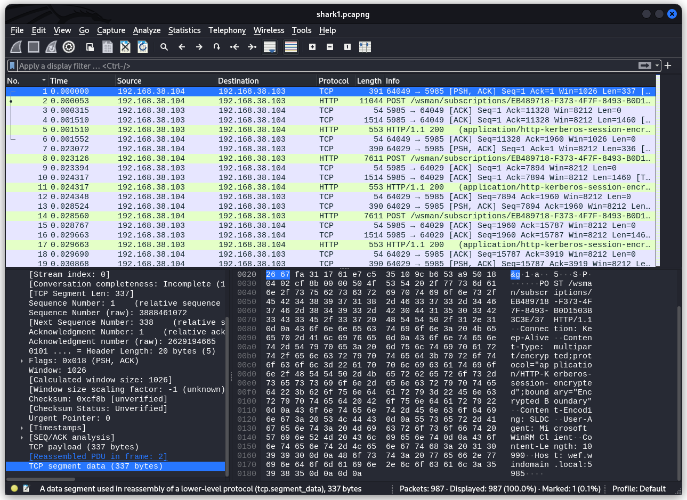
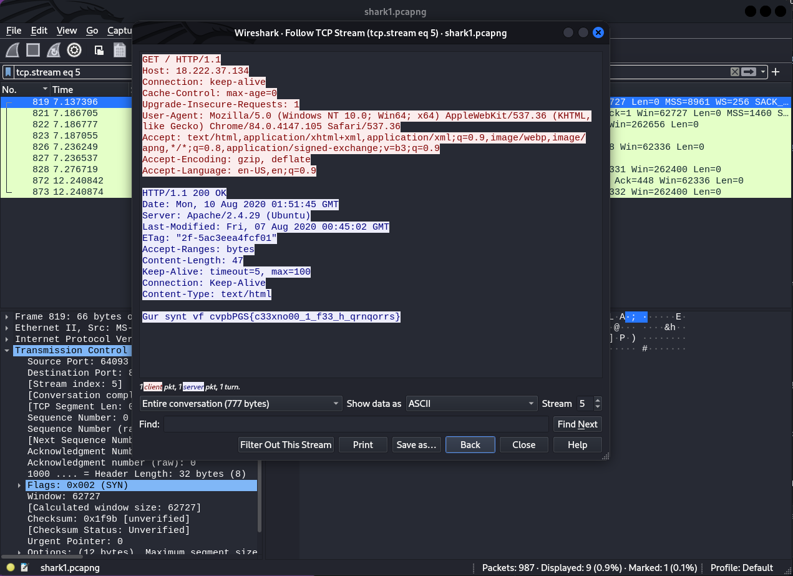
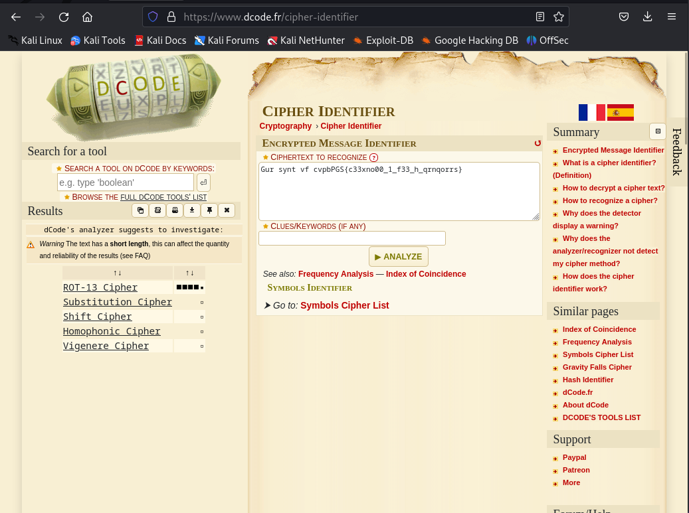
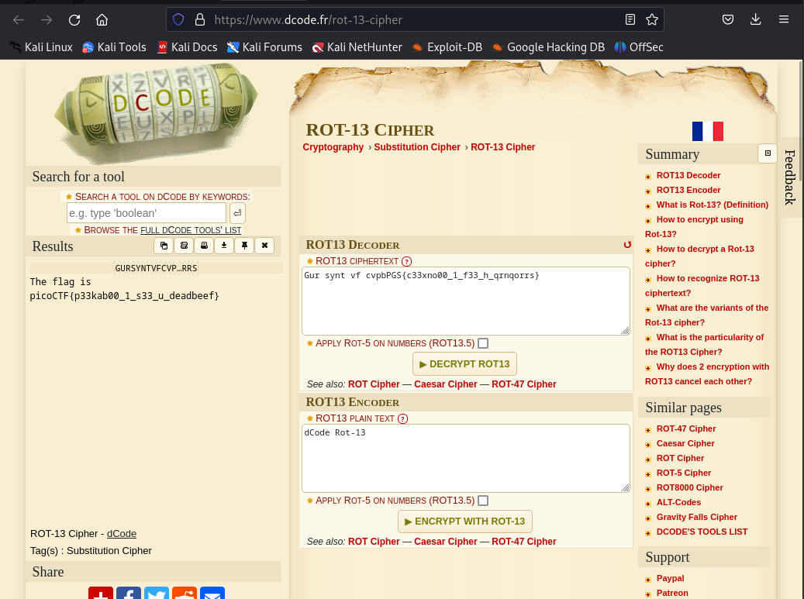

### Wireshark doo dooo do doo...
Tags:  

------------
Author: Danny 

**Description** 

Can you find the flag? [shark1.pcapng](https://mercury.picoctf.net/static/4c996ecfb7fbada15a9799511f24dc99/shark1.pcapng).

------------

**Hints** 

1-(None) 

------------
# Solution

1-opened the shark1.pcapng file & there was TCP and HTTP traffic  

 

2-i followed the TCP stream and stream 5 looked like it has an encrypted text `Gur synt vf cvpbPGS{c33xno00_1_f33_h_qrnqorrs}` 

 

3-took that text and paste it in a [Cipher Identifier](https://www.dcode.fr/cipher-identifier), looks like it's a [ROT-13 Cipher](https://www.dcode.fr/rot-13-cipher) 

 

4-After Decrypting the this `Gur synt vf cvpbPGS{c33xno00_1_f33_h_qrnqorrs}` in the [ROT-13 Cipher](https://www.dcode.fr/rot-13-cipher) the Result was: 

 

4- The flag is `picoCTF{p33kab00_1_s33_u_deadbeef}` 
