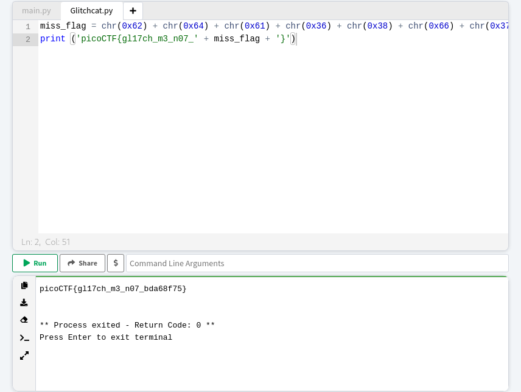

### Glitch Cat
Tags:  

------------
Author: LT 'syreal' Jones 
**Description** 
Our flag printing service has started glitching! `$ nc saturn.picoctf.net 52682`
------------

**Hints** 
1-ASCII is one of the most common encodings used in programming 
2-We know that the glitch output is valid Python, somehow! 
3-Press Ctrl and c on your keyboard to close your connection and return to the command prompt. 

------------
# Solution
1-  create a simple Python script   
Explanation : 
I know that 0x39 represents an hexadecimal character. And also, the chr function is Python 3 syntax. This function, simply “Return the string representing a character whose Unicode code point is the integer i” [source]( https://docs.python.org/3/library/functions.html#chr). In our case, we have 0x before the integer (indicating hexadecimal), therefore, it will convert from hexadecimal representation into the respective ASCII character. 
2- By using Python3 console we get our flag 
3- the output is:
`picoCTF{gl17ch_m3_n07_bda68f75}` 
# Screenshots

