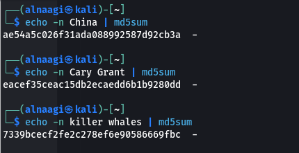
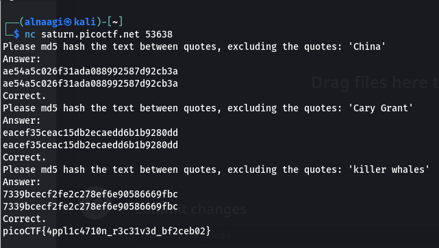

### HashingJobApp
Tags:  

------------
Author: LT 'syreal' Jones 

**Description** 

If you want to hash with the best, beat this test! `nc saturn.picoctf.net 53638`

------------

**Hints** 
1-You can use a commandline tool or web app to hash text  
2-Press Ctrl and c on your keyboard to close your connection and return to the command prompt. 

------------
# Solution
1-Exucuting this `` outputs this response `Please md5 hash the text between quotes, excluding the quotes: 'China'
Answer: ` 

2-made this script `echo -n China | md5sum` to md5 hash the given text   

3-after answering the 3 questions i got my flag `picoCTF{4ppl1c4710n_r3c31v3d_bf2ceb02}` 

