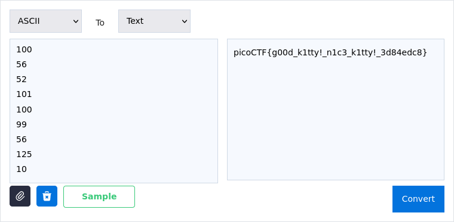

### Nice netcat...
Tags:  

------------
Author: syreal 
**Description** 
There is a nice program that you can talk to by using this command in a shell: `$ nc mercury.picoctf.net 49039`, but it doesn't speak English...

------------

**Hints** 
1-You can practice using netcat with this picoGym problem: [what is a netcat?](http://https://play.picoctf.org/practice/challenge/34 "what is a netcat?") 
2-You can practice reading and writing ASCII with this picoGym problem: [Let's Warm Up](https://play.picoctf.org/practice/challenge/22") 

------------
# Solution
1-  run this in the Terminal `nc mercury.picoctf.net 49039` 
2- you will have this output: 
`112 105 99 111 67 84 70 123 103 48 48 100 95 107 49 116 116 121 33 95 110 49 99 51 95 107 49 116 116 121 33 95 51 100 56 52 101 100 99 56 125 10` 
3- copy and take this output to a ASCII to Text converter [Link](https://www.duplichecker.com/ascii-to-text.php) 
4- the flag is `picoCTF{g00d_k1tty!_n1c3_k1tty!_3d84edc8}` 
# Screenshots

