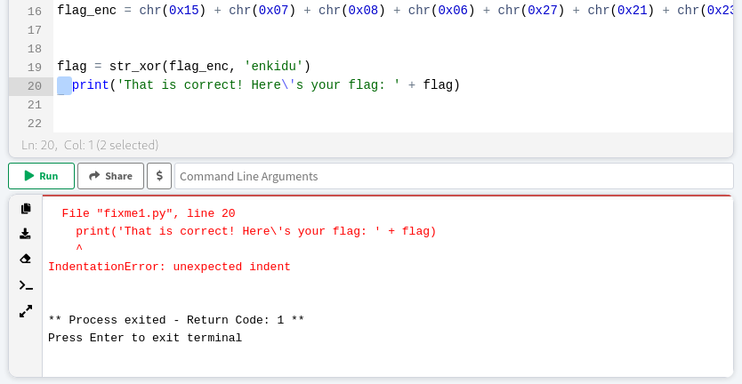

### fixme1.py
Tags:  

------------
Author: LT 'syreal' Jones 
**Description** 
Fix the syntax error in this Python script to print the flag. [Download Python script](https://artifacts.picoctf.net/c/27/fixme1.py)
------------

**Hints** 
1-Indentation is very meaningful in Python 
2-To view the file in the webshell, do: $ nano fixme1.py 
3-To exit nano, press Ctrl and x and follow the on-screen prompts. 
4-The str_xor function does not need to be reverse engineered for this challenge. 

------------
# Solution
1-  Fix the Unexpected indent (or TabError) on line 20  
Explanation : 
Python uses spacing at the start of the line to determine when code blocks start and end. Errors you can get are: 
Unexpected indent. This line of code has more spaces at the start than the one before, but the one before is not the start of a subblock (e.g., the if, while, and for statements). All lines of code in a block must start with exactly the same string of whitespace. 
2- By Deleting 2 spaces before the print function the code will work normally 
3- the output is:
`That is correct! Here's your flag: picoCTF{1nd3nt1ty_cr1515_182342f7}` 
# Screenshots

