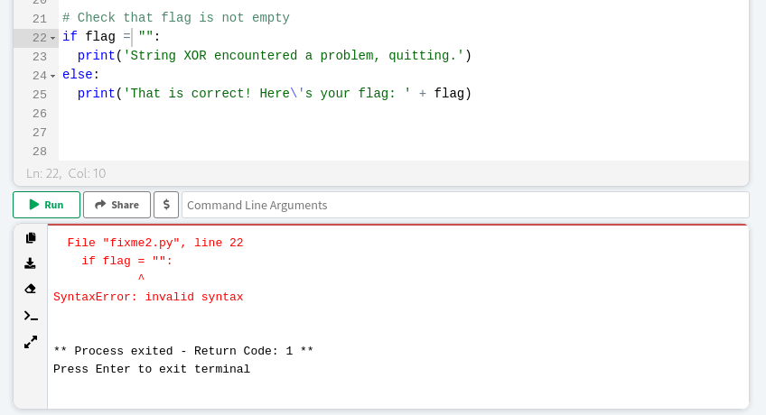
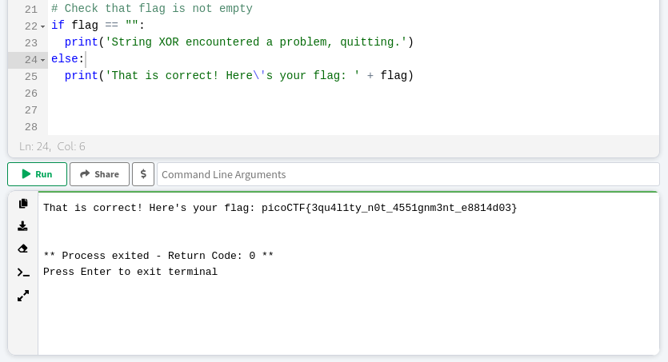

### fixme2.py
Tags:  

------------
Author: LT 'syreal' Jones 
**Description** 
Fix the syntax error in this Python script to print the flag. [Download Python script](https://artifacts.picoctf.net/c/4/fixme2.py)
------------

**Hints** 
1-Are equality and assignment the same symbol? 
2-To view the file in the webshell, do: $ nano fixme2.py 
3-To exit nano, press Ctrl and x and follow the on-screen prompts. 
4-The str_xor function does not need to be reverse engineered for this challenge. 

------------
# Solution
1-  Fix the SyntaxError: invalid syntax on line 22  
Explanation : 
it is important to understand the concept of different Python operators, including “=” for value assignment, “==” for equality comparison, and other arithmetic, logical, and bitwise [operators]( https://docs.python.org/3/library/operator.html). 
2- By Adding =  to the = in the code to make it == and it will work normally 
3- the output is:
`That is correct! Here's your flag: picoCTF{3qu4l1ty_n0t_4551gnm3nt_e8814d03}` 
# Screenshots
 

