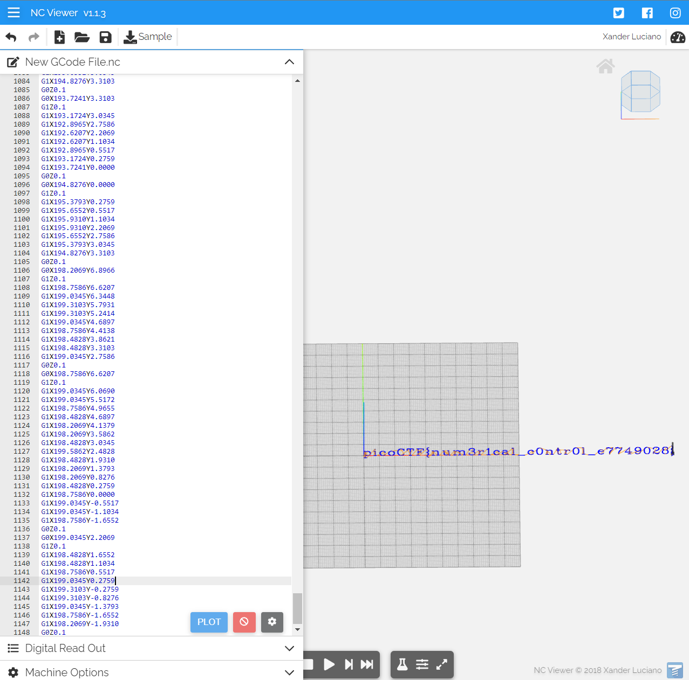

### speeds and feeds
Tags:  

------------
AUTHOR: RYAN RAMSEYER 
**Description** 
There is something on my shop network running at `nc mercury.picoctf.net 33596`, but I can't tell what it is. Can you?
------------

**Hints** 
1-What language does a CNC machine use? 

------------
# Solution
1-The CNC Machine language is Gcode. 
2-Copy & paste the terminal output into Gcode viewer [ncviewer](https://ncviewer.com/) 
3- the flag is:`picoCTF{num3r1cal_c0ntr01_e7749028}` 
# Screenshots

