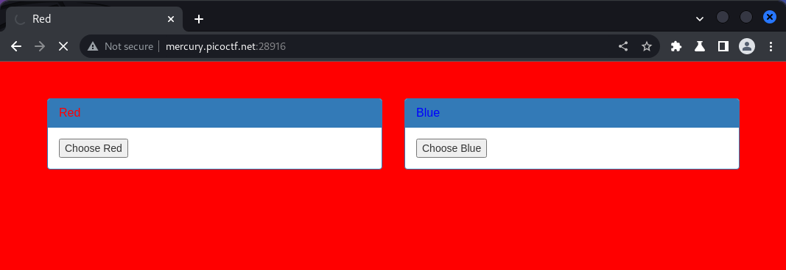
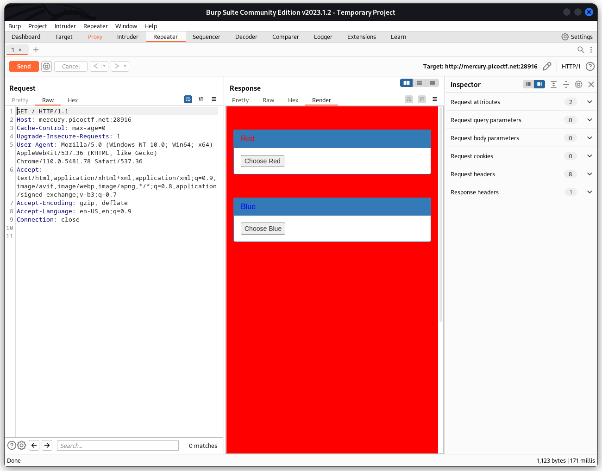
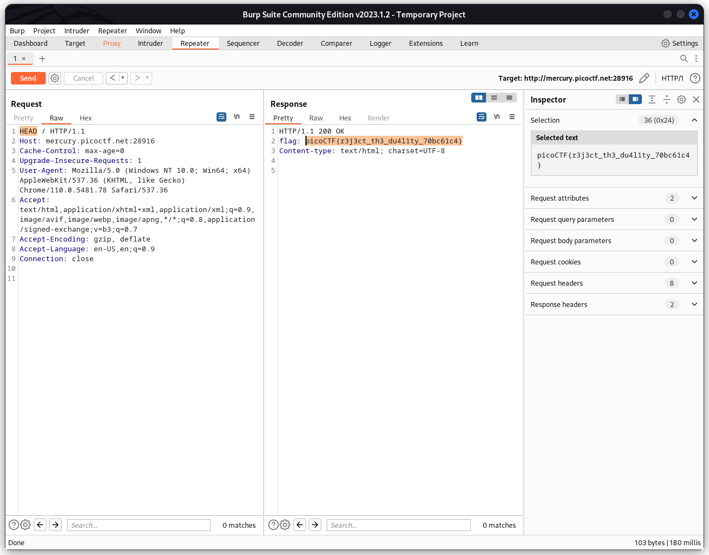

### Get_aHead
Tags:  

------------
Author: madStacks 
**Description** 

Find the flag being held on this server to get ahead of the competition [http://mercury.picoctf.net:28916/](http://mercury.picoctf.net:28916/)

------------

**Hints** 
1-Maybe you have more than 2 choices 

2-Check out tools like Burpsuite to modify your requests and look at the responses 

------------
# Solution
1-upon opening the site we get to buttons "Choose Red" & "Choose Blue"

2-The Ctf name gave a nice hint About a HEAD 

3-I opened up burpsuit, Intercepted the Request sent it to the Repeater

4-Changed the Request Method grom GET to HEAD and suprise suprise we got the flag

5-flag: `picoCTF{r3j3ct_th3_du4l1ty_70bc61c4}`
