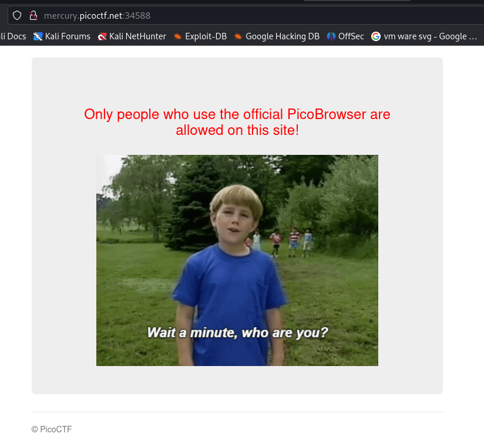
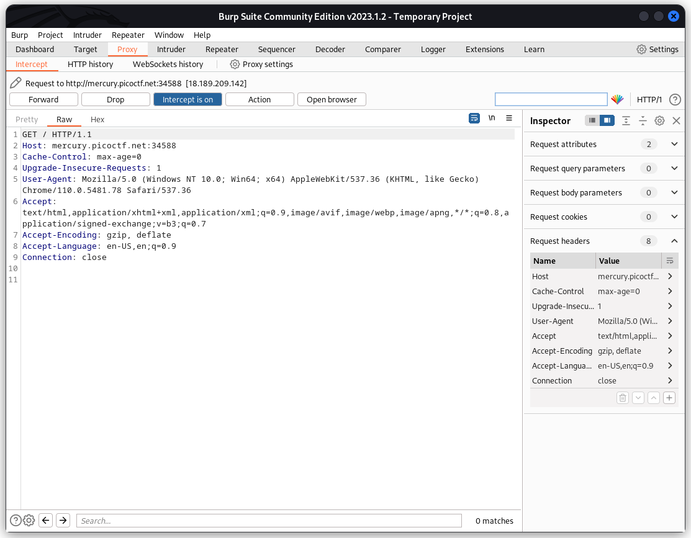
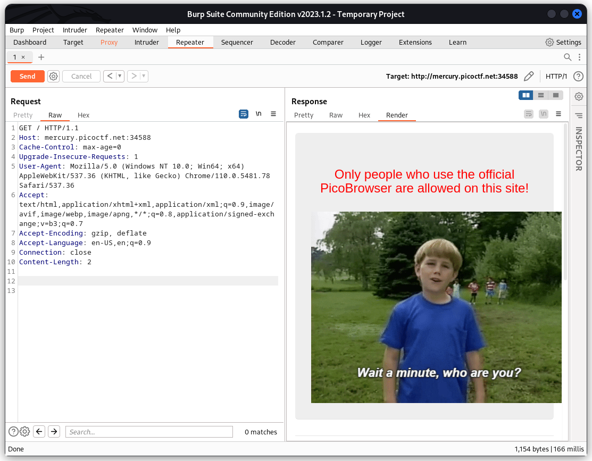
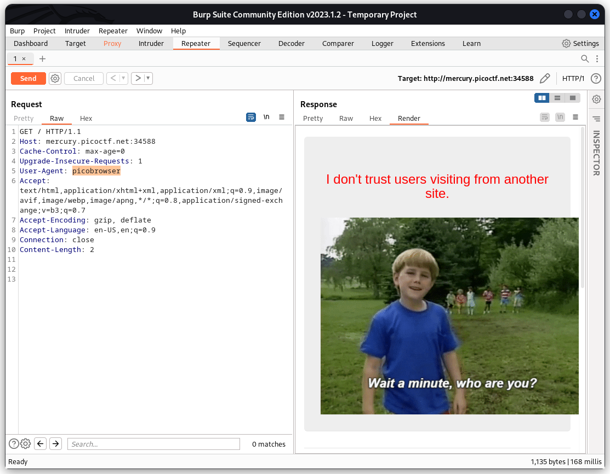
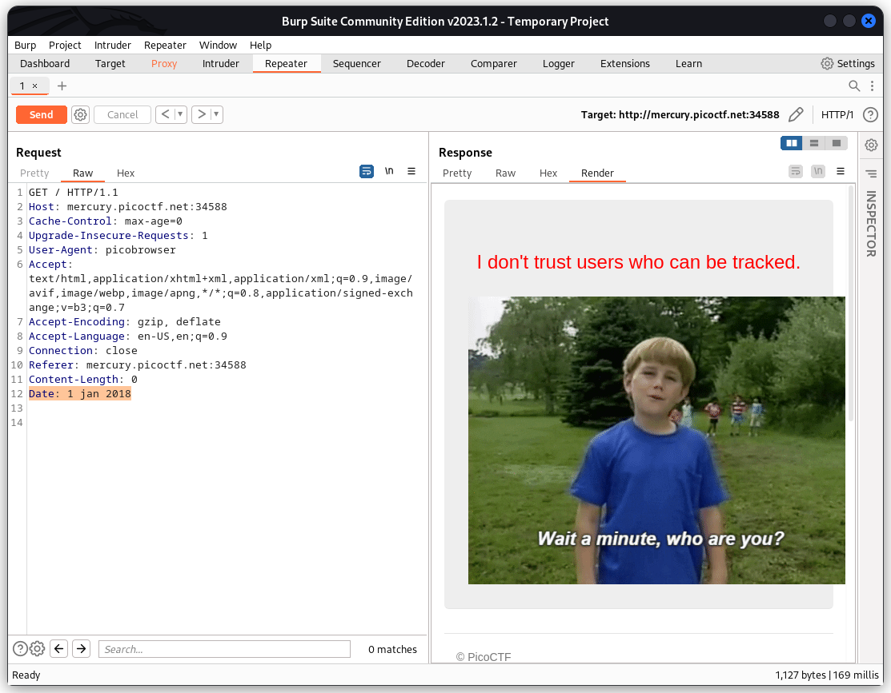
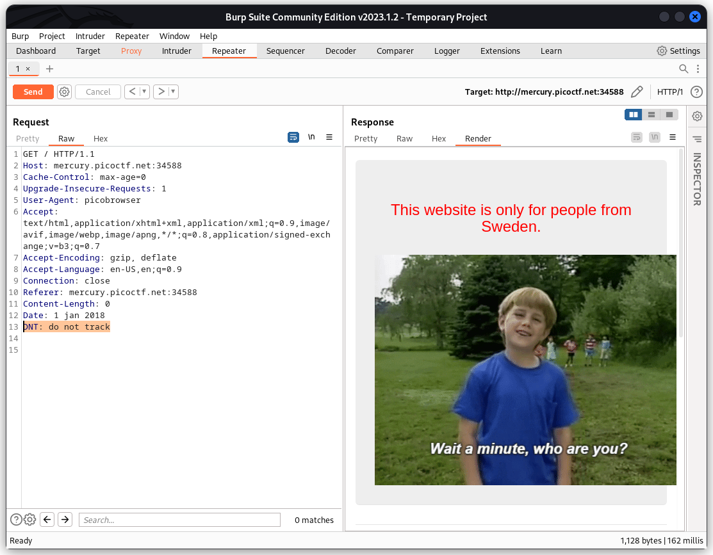
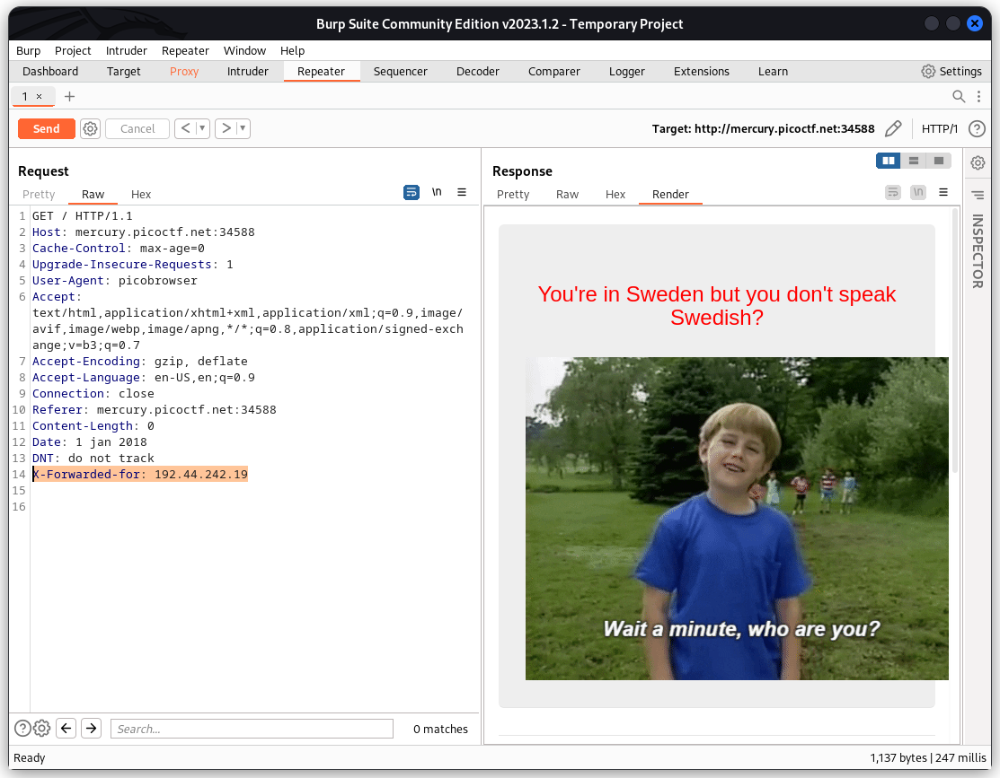
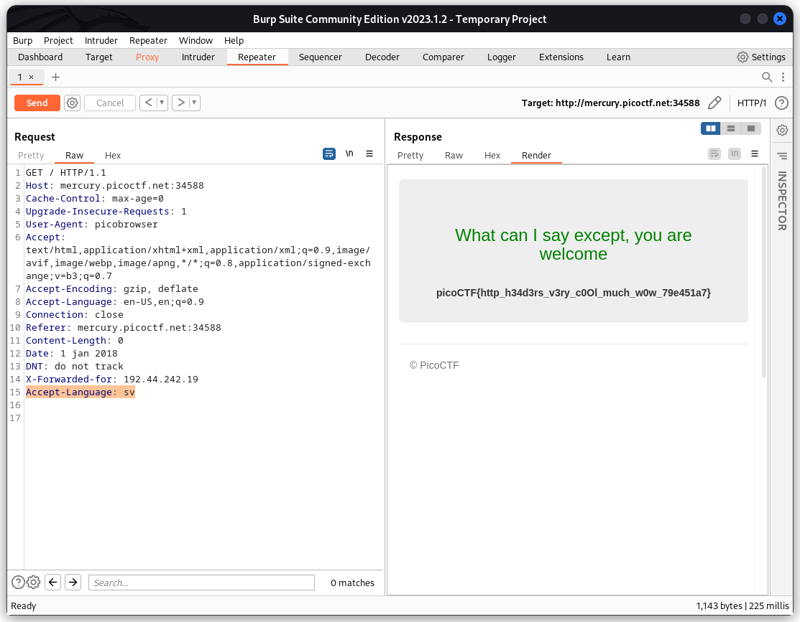

### Who are you ?
Tags:  

------------
Author: madStacks 

**Description** 

Let me in. Let me iiiiiiinnnnnnnnnnnnnnnnnnnn [http://mercury.picoctf.net:34588/](http://mercury.picoctf.net:34588/)

------------

**Hints** 
1-It ain't much, but it's an RFC [https://tools.ietf.org/html/rfc2616](https://tools.ietf.org/html/rfc2616)  

------------
# Solution
1-When we visit the site it says `Only people who use the official PicoBrowser are allowed on this site!` 

 

2-There are many ways to approach this,but I ended up using Burp Suit, I intercepted the Request.

3-Then sent the intercepted request to the Repeater with the ( Action Button or Ctrl+R ),now we can see the Request and response side by side

4-after changing the "User-Agent" to "picobrowser" we got this response

5-now it says (I don't trust users visiting from another site.) we need to add the header :"Referer" to make the header show it's from the same site `Referer: mercury.picoctf.net:34588`   

 

6-now it says (Sorry, this site only worked in 2018.) we need to add the header: "Date" to make it think we are from 2018 `Date: 1 jan 2018` 

 

7-now it says (I dont trust users who can be tracked) we need to add the header: "DNT" to not get tracked `DNT: do not track` 

 

8-now it says (This website is only for people from Sweden.) we need to add the header: "X-Forward-for" to change the ip and we need to find a Sweden ip address`X-Forward-for: 192.44.242.19
` 

 

9-now it says (You're in Sweden but you don't speak Swedish?) we need to add the header: "Accept-Language" to change the Language to Swedish `Accept-Language: sv` 

 

10-Success We got the flag, the flag is picoCTF{http_h34d3rs_v3ry_c0Ol_much_w0w_79e451a7}
