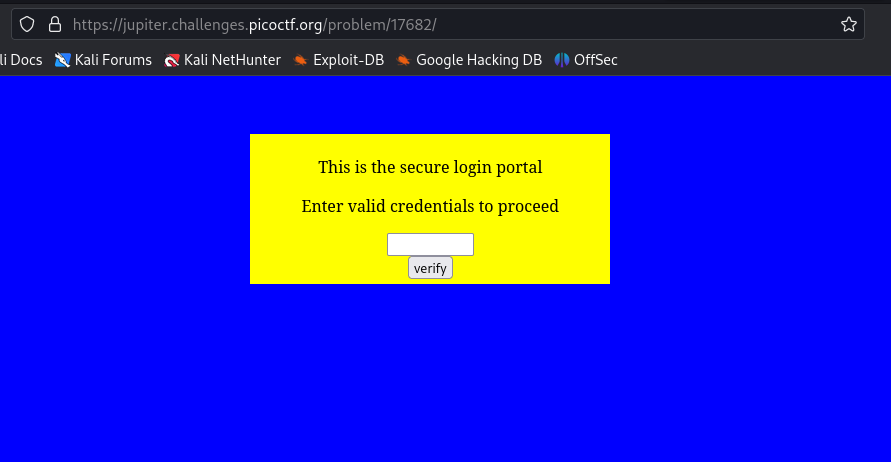
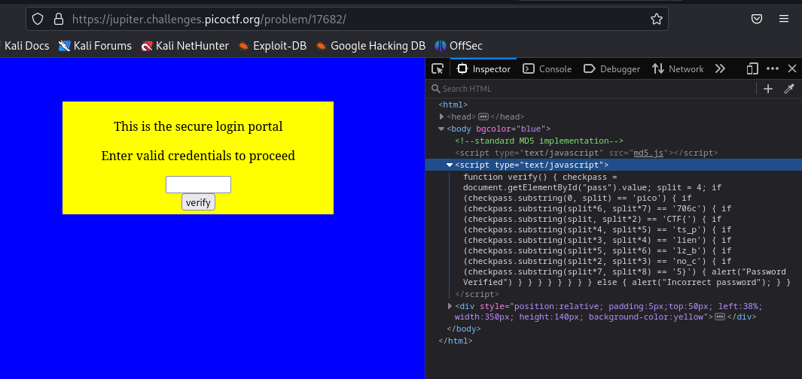
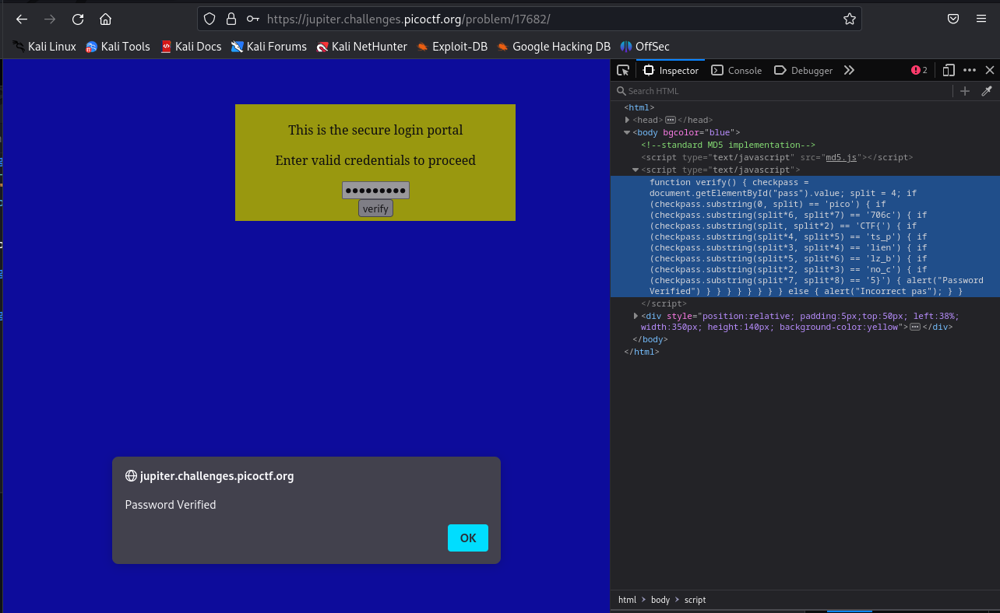

### dont-use-client-side
Tags:  

------------
Author: Alex Fulton/Danny 

**Description** 

Can you break into this super secure portal? https://jupiter.challenges.picoctf.org/problem/17682/ [link](https://jupiter.challenges.picoctf.org/problem/17682/) or `http://jupiter.challenges.picoctf.org:17682`

------------

**Hints** 
1-Never trust the client  

------------
# Solution
1-I'm greated with a secure login portal 

 

2-I F12 Inspect the Code, found something interesting a javascript for verification 

3-in the script there is the word pico let me try to Sort the Splits in Order 

4-this looks like a flag `picoCTF{no_clients_plz_b706c5}` 

5-it is a flag and password verified 

 
